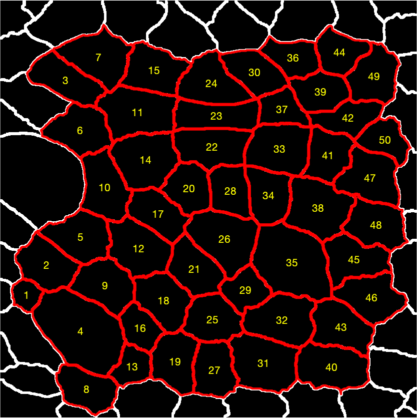

# Cellbycell

This script is to quantify cell-cell borders fluorescence intensities on cell-by-cell basis.

## Input data

**INPUT FILES** should be localised to two subfolders:
* *original*: original microscopy files

* *borders*: the corresponding 8-bit images segmented with 
Packing Analyser. The subfolders (1,2,3,4...) should contain
tracked_bd.png and vertices.png files from Packing Analyser.

## Running the script
1. Start by running Intensity_wing.m

1. It gives choice to analyse embryos or wings.

## Output files and format

The following folders will be automatically created depending on the selection at the start of a run.
1. **Cells** with adjusted images the borders mask and numbers of each analysed cell. 

1. **Distributions** with images with plotted cell-by-cell distributions of mean signal at the border along the z-axis.

1. **Distributions_fit** with figure where cell-by-cell distributions of mean signal at the border along the z-axis are fit with Gaussian alongside with p-value of the goodness-of-fit for each cell; it will also have tables with data for each cell (see below) with and without applying a stated threshold (cutoff) for the goodness of signal fit.

1. **summary** with the summarised alongside pulled data.

## Output data explained

The following columns record cell-by-cell data:
1. **wing** - the number of the image.
1. **cell** - cell number, which correspond to the cell number in *images_analysed*.
1. **Mean** - mean of the distribution of mean signal at the border along the z-axis.
1. **Total** - surface under the distribution of mean signal at the border along the z-axis calculated using *trapz* function and multiplied by the size of the mask used for extracting the border signal in each cell.
1. **Zposition** - position of the center of the Gaussian fit.
1. **Width** - &sigma of the Gaussian distribution related to the full width at half maximum (FWHM) as FWHM ≈ 2.355*&sigma);
1. **Area** - area in pixels of each cell.
1. **Eccentricity** - eccentricity of each cell.
In the files with averaged data each value will be followed by it standard deviation in the next column.
